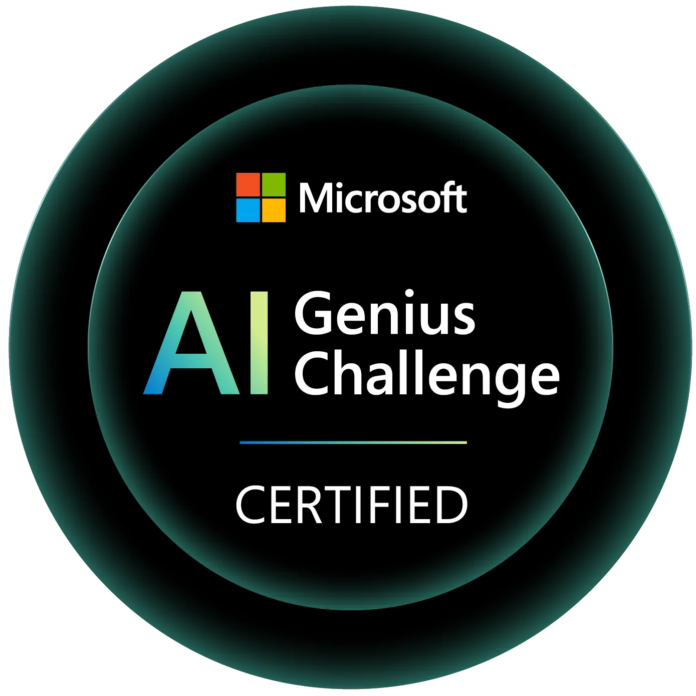

#  Microsoft AI Genius Challenge – Ground Truth Submission

This repo contains my submission for the Microsoft AI Genius Challenge Series 2.0. The challenge was built around a simulated global zero-day cyberattack, and we were tasked with investigating, responding, and building a working solution using the tools and concepts from the AI Genius Series.

##  What This Is

A hands-on sprint where I:
- Investigated a fictional breach involving a zero-day exploit called **Blue Raven**
- Analyzed encrypted logs, malware behavior, and forensic data
- Built a working Flask app to simulate parts of the investigation and response
- Integrated Azure services to handle document ingestion, search, and insight generation
- Cleaned up secrets, structured the repo, and earned the badge

##  Tools I Used

- **Flask** for the web app
- **Azure Cognitive Search** for indexing and querying forensic documents
- **Azure OpenAI** for generating insights and summaries
- **Python** for scripting and orchestration
- **GitHub** for version control and push protection (yes, it caught my secrets—lesson learned)

##  Repo Structure
flask-app2/ ├── app.py ├── uplddocs.py ├── create_index.py ├── import_openai.py ├── import_requests.py ├── requirements.txt ├── .gitignore ├── README.md ├── LICENSE └── badge.png
##  Badge of Honour

This badge wasn’t handed out—it was earned. Through debugging, refactoring, and pushing through Git errors and credential chaos, I built something that reflects both technical skill and personal growth.

##  Notes from the Challenge

- The attack was staged using a fake ransomware note, but the real threat was a buffer overflow in custom web gateway software
- The malware (Blue Raven) encrypted and exfiltrated data using a hardcoded AES key
- The forensic logs were unreadable without reverse engineering the payload
- The challenge was time-boxed to 2 hours, but I went deeper—because I wanted to understand, not just finish

##  What I Took Away

- Push protection is real—GitHub flagged my secrets and saved me from myself
- REST APIs give you more control than GUIs when working with Azure Search
- Environment isolation matters—especially when juggling multiple SDKs
- Every bug is a breadcrumb. Follow it, and you’ll find clarity
